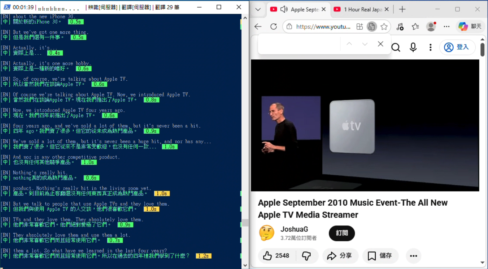
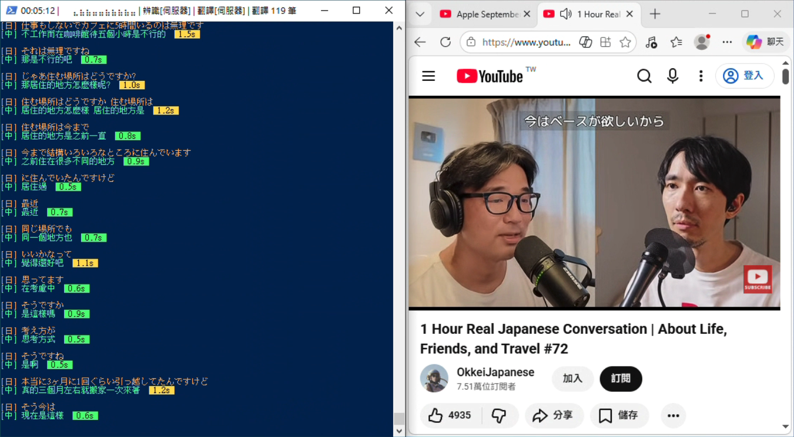

# jt-live-whisper 安裝與使用 SOP

即時英翻中字幕系統 v2.14.1 (by Jason Cheng)

| **目錄** | [系統架構](#一系統架構) · [音訊設定](#二事前準備音訊設定) · [安裝程式](#三安裝程式) · [啟動與使用](#四啟動與使用) · [使用流程總結](#五使用流程總結) · [常見問題](#六常見問題) · [檔案說明](#七檔案說明) · [硬體建議](#硬體建議) |
|---|---|

將英文語音即時轉錄並翻譯成繁體中文字幕顯示於終端機。採用系統音訊裝置層級擷取（macOS 使用 BlackHole 虛擬音訊裝置，Windows 使用 WASAPI Loopback），**理論上任何軟體的聲音輸出都能即時處理**：視訊會議（Zoom、Teams、Meet）、YouTube、Podcast、串流影片、教育訓練等，不限定特定應用程式。亦可離線處理音訊檔案。

適用平台：macOS（Apple Silicon / Intel）/ Windows 10+

**全地端執行，不依賴雲端服務。** 所有語音辨識、翻譯、摘要皆在自有設備上完成，音訊資料不會離開你的網路環境。有兩種部署方式：

- **單機模式**： 一台 Mac 或 Windows PC 即可完成所有處理。語音辨識（Whisper/Moonshine）、翻譯（LLM/NLLB/Argos）全部在本機執行，不需要額外硬體。適合個人使用、外出攜帶。

- **本機 + GPU 伺服器模式**： 本機負責音訊擷取與介面操作，語音辨識和講者辨識交由區域網路內的 GPU 伺服器（如 DGX Spark，或安裝有 NVIDIA GPU 的 Ubuntu/Linux 主機，搭消費級 RTX 4090/5090 之類亦可，需已安裝 CUDA）處理。離線辨識速度快 5-10 倍，仍然是全地端架構，資料僅在區域網路內傳輸。適合需要處理大量音訊或追求即時辨識品質的場景。

兩種模式可隨時切換，GPU 伺服器離線時自動降級為本機處理，不中斷使用。

---

## 一、系統架構

**即時模式：**

```
系統音訊（macOS: BlackHole 2ch / Windows: WASAPI Loopback）
  → 擷取一份音訊給程式（macOS 透過虛擬裝置複製，Windows 直接擷取系統播放）
    → Whisper / Moonshine（即時語音辨識）           ← 本機或 GPU 伺服器
      → LLM（Ollama / OpenAI 相容）/ NLLB / Argos（翻譯）
        → 終端機顯示字幕 + logs/ 記錄檔
```

**離線處理模式（--input）：**

```
音訊檔案（mp3 / wav / m4a / flac 等）
  → ffmpeg 轉檔（→ recordings/ 暫存 16kHz mono WAV）
    → faster-whisper（離線語音辨識）                        ← 本機或 GPU 伺服器
      → （選配）resemblyzer + spectralcluster（講者辨識）   ← 本機或 GPU 伺服器
        → LLM（Ollama / OpenAI 相容）/ NLLB / Argos（翻譯）
          → 終端機顯示 + logs/ 記錄檔
            → （選配）LLM 摘要 → logs/
```

**GPU 伺服器架構（選配）：**

```
[本機 macOS / Windows]                          [伺服器 Linux + NVIDIA GPU]

translate_meeting.py                            remote_whisper_server.py (FastAPI)
  - 音訊擷取 / 轉檔                              - /v1/audio/transcriptions (ASR)
  - 上傳音訊到伺服器        --- HTTP --->           - /v1/audio/diarize（講者辨識）
  - 接收辨識結果          <-- JSON ---           - faster-whisper + GPU CUDA
  - LLM 翻譯 / 顯示 / 儲存                      - resemblyzer + GPU CUDA
  - SSH 啟停伺服器     --- SSH --->
```

有設定 GPU 伺服器時，語音辨識和講者辨識自動在伺服器執行（離線 30 分鐘音訊：本機約 3-5 分鐘，GPU 伺服器約 10-30 秒）。伺服器失敗時自動降級本機。多個用戶端可同時共用同一個伺服器。

使用的 AI 模型：

| 用途 | AI 模型 | 執行位置 |
|------|---------|----------|
| 語音辨識 (即時) | **whisper.cpp** | 本機或 GPU 伺服器 |
| 語音辨識 (即時) | **faster-whisper** (CTranslate2) | 本機（Windows 即時 + 全平台離線） |
| 語音辨識 (即時) | **mlx-whisper** | 僅限 Apple Silicon（雙向模式 GPU 加速） |
| 語音辨識 (即時) | **Moonshine** (Useful Sensors) | 僅限 Apple Silicon |
| 講者辨識 | **resemblyzer** + **spectralcluster** | 本機或 GPU 伺服器 |
| 翻譯 / 摘要 | **Qwen 2.5** / **Phi-4** 等 LLM，或搭配使用者自行安裝的模型使用 | 本機或區域網路 LLM 伺服器 |
| 翻譯 (離線) | **NLLB 600M** (Meta) | 僅限本機 |
| 翻譯 (離線備援) | **Argos Translate** | 僅限本機 |

語音辨識引擎：
- **Whisper**（推薦，預設）：高準確度，完整斷句，支援中日英文，可在本機或 GPU 伺服器執行
- **Moonshine**（替代，僅英文）：真串流架構，延遲 ~300ms（僅限本機）
- **faster-whisper**（離線處理專用）：CTranslate2 引擎，Python API，支援 VAD，可在本機或 GPU 伺服器執行

你仍然可以正常從喇叭或耳機聽到聲音。macOS 的 BlackHole 會額外複製一份音訊給辨識程式；Windows 的 WASAPI Loopback 則直接擷取系統播放的音訊，不需要安裝額外驅動。

**目錄結構：**

```
realtime_voice_translate/
  translate_meeting.py     主程式
  start.sh                 啟動腳本（macOS）
  start.ps1                啟動腳本（Windows）
  install.sh               安裝腳本（macOS）
  install.ps1              安裝腳本（Windows）
  config.json              使用者設定（自動產生）
  logs/                    記錄檔、摘要檔（自動建立）
  recordings/              暫存音訊轉檔（自動建立，處理完自動清除）
  whisper.cpp/             Whisper 引擎（macOS 自動編譯，Windows 下載預編譯版本）
  venv/                    Python 虛擬環境
```

---

## 二、事前準備：音訊設定

### macOS 音訊設定

#### 2-1. 安裝 BlackHole 虛擬音訊驅動

`./install.sh` 會自動安裝 BlackHole，不需手動執行。

安裝完成後**必須重新啟動電腦**，BlackHole 才會生效。

#### 2-2. 建立「多重輸出裝置」

BlackHole 2ch 是虛擬音訊裝置，搭配 macOS「多重輸出裝置」將系統音訊同時送給你的耳機/喇叭和本程式，音訊流向如下：

```
任何應用程式的聲音（Zoom / Teams / Meet / YouTube / Podcast ...）
  │
  ▼
macOS 多重輸出裝置（你建立的）
  ├──▶ MacBook 揚聲器 / AirPods / 耳機（你照常聽到聲音）
  └──▶ BlackHole 2ch（虛擬音訊裝置，無聲複製一份）
         │
         ▼
    jt-live-whisper 讀取 BlackHole 音訊
      → AI 語音辨識 → 翻譯 → 終端機即時字幕
```

1. 開啟 **「音訊 MIDI 設定」**（Audio MIDI Setup）
   - Spotlight 搜尋「音訊 MIDI 設定」，或從 `/Applications/Utilities/Audio MIDI Setup.app` 開啟
2. 點左下角 **「+」** → 選擇 **「建立多重輸出裝置」**
3. 在右側勾選：
   - v 你的喇叭或耳機（例如「MacBook Air 的喇叭」或 AirPods）
   - v **BlackHole 2ch**
4. 確認你的喇叭/耳機排在 BlackHole **上方**（可拖曳調整順序）
5. 勾選 **BlackHole 2ch** 的 **「主裝置」**（Master Device）欄位


> **重要：主裝置務必選 BlackHole，不要選耳機/喇叭。** BlackHole 是虛擬裝置，永遠不會斷線。如果主裝置設為藍牙耳機（例如 AirPods），一旦耳機斷線，整個多重輸出裝置會失效，導致 Zoom 等應用程式音訊中斷且無法恢復，必須重建裝置或重開機。

#### 2-3. 設定音訊輸出

將系統音訊輸出切換到多重輸出裝置，讓 BlackHole 能收到聲音：

1. 打開 **「系統設定」→「聲音」→「輸出」**
2. 選擇剛才建立的 **「多重輸出裝置」**


> **注意：** 多重輸出裝置下無法用系統音量鍵調整音量。如需調整音量，請用應用程式內部的音量控制（如 Google Meet 的音量滑桿）。

> **重要：Zoom / Teams 等視訊軟體的喇叭（輸出）也要設成「多重輸出裝置」，不能直接選 AirPods 或喇叭。** 如果直接選 AirPods，聲音不會經過 BlackHole，程式就收不到對方的聲音。麥克風（輸入）維持原本的設定即可，不需要改。

#### 2-4. 建立「聚集裝置」（選配，錄音時需要錄到自己的聲音才需要）

即時轉錄的 ASR 辨識裝置固定使用 BlackHole 2ch（只擷取對方聲音），這樣辨識最準確。但如果你啟用了 `--record` 錄音功能，想要**同時錄下對方和自己的聲音**，就需要建立聚集裝置（Aggregate Device）。

建立步驟：

1. 開啟 **「音訊 MIDI 設定」**（Spotlight 搜尋「音訊 MIDI 設定」）
2. 點左下角 **「+」** → 選擇 **「建立聚集裝置」**（Create Aggregate Device）
3. 勾選：
   - v **BlackHole 2ch**（系統音訊，對方的聲音）
   - v **你的麥克風**（例如「MacBook Air 的麥克風」或 AirPods 麥克風）
4. **時脈來源選 BlackHole 2ch**（虛擬裝置時脈穩定，不會因藍牙斷線而失效）
5. 其他實體裝置勾選 **「偏移修正」**（Drift Correction）
6. 取個好認的名稱，例如「聚集錄音」


> **重要：時脈來源務必選 BlackHole 2ch。** 原因與多重輸出裝置相同：BlackHole 是虛擬裝置，時脈永遠穩定。如果選實體裝置（如 AirPods 或 MacBook 麥克風），藍牙斷線或裝置休眠會導致時脈來源消失，整個聚集裝置跟著失效。

建好之後，程式會自動偵測聚集裝置作為錄音裝置，不需要手動選擇。如果偵測不到聚集裝置，會自動降級使用 BlackHole（僅錄對方聲音）。

**ASR 辨識裝置 vs 錄音裝置的差別：**

| 用途 | 選擇的裝置 | 擷取內容 | 說明 |
|---|---|---|---|
| ASR 即時辨識 | BlackHole 2ch | 僅對方聲音 | 即時字幕只處理對方語音，無法辨識自己的聲音 |
| 錄音 | 聚集裝置 | 對方 + 自己 | 同時錄下雙方聲音，事後用 `--input` 離線轉錄含自己的聲音 |

**Zoom / Teams 的設定不需要改：**

| 設定項目 | 選擇 | 說明 |
|---|---|---|
| Teams/Zoom 喇叭（輸出） | 多重輸出裝置 | 聲音同時送到耳機和 BlackHole |
| Teams/Zoom 麥克風（輸入） | AirPods / 原本的麥克風 | 對方聽到你說話，不受影響 |

完整音訊流向：

```
對方說話 → Teams 輸出 → 多重輸出裝置 → AirPods（你聽到）
                                       → BlackHole（ASR 辨識 + 聚集裝置的一部分）

你說話 → AirPods 麥克風 → Teams 輸入（對方聽到）

錄音時：
  聚集裝置 = BlackHole（對方聲音）+ MacBook 麥克風（你的聲音）
  → 程式同時錄下雙方聲音為 WAV 檔
```

#### 2-5. 驗證音訊設定

1. 播放一段英文影片或音訊
2. 確認你的喇叭/耳機有聲音
3. 回到「音訊 MIDI 設定」，確認 BlackHole 2ch 的音量指示器有跳動

### Windows 音訊設定

Windows 不需要安裝額外的虛擬音訊驅動。程式透過 WASAPI Loopback 直接擷取系統播放的音訊。

#### 2-W1. 確認音訊裝置

程式會自動偵測含有 "loopback" 或 "stereo mix" 的音訊裝置。大多數情況下不需要手動設定。

如果自動偵測失敗，可嘗試啟用「立體聲混音」（Stereo Mix）：

1. 右鍵點選工作列通知區域的音量圖示 → 「音效設定」（或「開啟音效設定」）
2. 點選「更多音效設定」→ 切換到「錄製」分頁
3. 在空白處右鍵 →「顯示已停用的裝置」
4. 找到「立體聲混音」（Stereo Mix），右鍵 →「啟用」
5. 若找不到「立體聲混音」，表示音效驅動未提供此功能，可嘗試更新音效驅動

> **注意：** 部分音效驅動（尤其是 Realtek 較舊版本）預設隱藏或不提供 Stereo Mix。大多數現代 Windows 系統的 WASAPI Loopback 模式可正常運作，不需要 Stereo Mix。

#### 2-W2. 驗證音訊設定

1. 播放一段英文影片或音訊
2. 開啟 PowerShell，執行 `.\start.ps1 --list-devices`
3. 確認列表中有 loopback 或 stereo mix 裝置

---

## 三、安裝程式

### 3-1. 一鍵安裝

**macOS：**

打開終端機，貼上以下指令即可自動下載並安裝所有元件：

```bash
mkdir -p ~/Apps/jt-live-whisper && cd ~/Apps/jt-live-whisper
curl -fsSL https://raw.githubusercontent.com/jasoncheng7115/jt-live-whisper/main/install.sh -o install.sh
bash install.sh
```

**Windows：**

開啟 PowerShell（以管理員身份），建立資料夾並切換過去（不需要 Git）：

```powershell
mkdir C:\jt-live-whisper -Force | Out-Null; cd C:\jt-live-whisper
```

下載安裝程式：

```powershell
irm https://raw.githubusercontent.com/jasoncheng7115/jt-live-whisper/main/install.ps1 -OutFile install.ps1
```

執行安裝：

```powershell
powershell -ExecutionPolicy Bypass -File install.ps1
```

安裝腳本會自動檢查並安裝以下項目：

> **首次安裝預估時間：約 10～20 分鐘**（視網路速度而定）。主要耗時項目：
> - whisper.cpp 編譯：約 3～5 分鐘（macOS 需從原始碼編譯；Windows 下載預編譯版本，較快）
> - whisper 模型下載：約 3～10 分鐘（large-v3-turbo 約 809MB）
> - Argos 翻譯模型下載與安裝：約 2～3 分鐘
>
> 安裝過程中終端機會持續輸出訊息，請耐心等待，不要中斷。

**本機安裝項目（macOS）：**

| 項目 | 說明 |
|---|---|
| [Homebrew](https://brew.sh/) | macOS 套件管理器（需事先安裝，安裝腳本不會自動安裝） |
| cmake | 編譯工具 |
| sdl2 | 音訊擷取函式庫 |
| ffmpeg | 音訊轉檔工具（--input 離線處理需要） |
| BlackHole 2ch | 虛擬音訊驅動 |
| Python 3.12 | Python 執行環境 |
| whisper.cpp | 即時語音辨識引擎（自動編譯） |
| whisper 模型 | 語音辨識模型（預設下載 large-v3-turbo） |
| Python venv | 虛擬環境 + ctranslate2、sentencepiece、sounddevice、numpy、faster-whisper、resemblyzer、spectralcluster |
| Moonshine ASR | 英文串流語音辨識引擎 + medium 模型 (~245MB) |
| NLLB 600M 翻譯模型 | 離線翻譯模型，中日英互譯 (~600MB) |
| Argos 翻譯模型 | 離線英→中翻譯模型 |

**本機安裝項目（Windows）：**

| 項目 | 說明 |
|---|---|
| [Python 3.12+](https://www.python.org/downloads/) | 從 python.org 下載安裝（安裝時勾選「Add to PATH」） |
| ffmpeg | 音訊轉檔工具（`winget install ffmpeg` 或從 [ffmpeg.org](https://ffmpeg.org/download.html) 下載） |
| whisper.cpp | 即時語音辨識引擎（自動下載預編譯版本） |
| whisper 模型 | 語音辨識模型（預設下載 large-v3-turbo） |
| Python venv | 虛擬環境 + ctranslate2、sentencepiece、sounddevice、numpy、faster-whisper、resemblyzer、spectralcluster |
| Moonshine ASR | 英文串流語音辨識引擎 + medium 模型 (~245MB) |
| NLLB 600M 翻譯模型 | 離線翻譯模型，中日英互譯 (~600MB) |
| Argos 翻譯模型 | 離線英→中翻譯模型 |

> **Windows 不需要：** Homebrew、cmake、sdl2、BlackHole。Windows 的 whisper.cpp 使用預編譯版本，不需要從原始碼編譯。音訊擷取使用 WASAPI Loopback，不需要虛擬音訊驅動。

**GPU 語音辨識伺服器（選填）：**

安裝最後會詢問是否設定 GPU 語音辨識伺服器。若有安裝 NVIDIA GPU 的 Ubuntu/Linux 主機（消費級 RTX 4090/5090 亦可，需已安裝 CUDA），安裝腳本會透過 SSH 自動在伺服器安裝以下套件，大幅加速語音辨識和講者辨識：

| 項目 | 說明 |
|---|---|
| PyTorch (CUDA) | GPU 加速框架（自動偵測 CUDA 版本選擇對應 wheel） |
| CTranslate2 / faster-whisper | Whisper 語音辨識引擎（GPU 加速版） |
| resemblyzer + spectralcluster | 講者辨識套件（GPU 加速聲紋提取） |
| FastAPI + uvicorn | 辨識 API 伺服器 |
| remote_whisper_server.py | 伺服器辨識服務程式（自動部署） |

未設定 GPU 伺服器時，所有語音辨識在本機執行，功能完全相同但速度較慢。

安裝程式會自動處理 SSH 金鑰：若 `config.json` 中設定的 SSH Key 不存在，會自動產生 ed25519 金鑰並部署公鑰到伺服器，之後免密碼登入。重複執行安裝程式時，已安裝的套件會自動跳過，不會重複安裝。

安裝前若偵測到 jt-live-whisper 相關程序正在執行，可選擇 K 強制結束程序後繼續安裝，避免檔案鎖定衝突（尤其 Windows）。

**磁碟空間需求（本機）：** 最小安裝約 3 GB（venv + 1 個 Whisper 模型 + 基本套件），推薦 8 GB 以上（含 HuggingFace 快取供離線處理用），完整安裝約 14 GB（全部模型 + Moonshine）。macOS 額外需要 Homebrew 套件約 140 MB（cmake + sdl2 + ffmpeg）。安裝腳本會在安裝前自動檢查可用空間。

**磁碟空間需求（GPU 伺服器）：** 最小安裝約 5 GB（PyTorch + 1 個模型），完整安裝約 12 GB（PyTorch + 全部 5 個模型 + 講者辨識套件）。

全部通過後會顯示：

```
  全部就緒！可以執行 ./start.sh 啟動系統。        ← macOS
  全部就緒！可以執行 .\start.ps1 啟動系統。       ← Windows
```

### 3-2. 升級至最新版本

```bash
# macOS
./install.sh --upgrade

# Windows (PowerShell)
.\install.ps1 -Upgrade
```

自動從 GitHub 下載最新版本的程式檔案（translate_meeting.py、start.sh、install.sh、SOP.md 等），不影響現有的 venv、whisper.cpp、模型和設定檔。升級後建議重新執行安裝腳本（macOS: `./install.sh`、Windows: `.\install.ps1`）確認相依套件完整。

### 3-3. 搬遷資料夾後

如果將資料夾搬到其他位置，只需重新執行安裝腳本（macOS: `./install.sh`、Windows: `.\install.ps1`），它會自動偵測並修復損壞的 venv 和 whisper.cpp。

---

## 四、啟動與使用

### 4-1. 啟動

先切換到安裝目錄：

```bash
# macOS
cd ~/Apps/jt-live-whisper

# Windows (PowerShell)
cd C:\jt-live-whisper
```

啟動程式：

```bash
# macOS
./start.sh

# Windows (PowerShell)
.\start.ps1
```

> **Windows 使用者請注意：** 以下範例以 macOS 指令為主。Windows 使用者請將 `./start.sh` 替換為 `.\start.ps1`，`./install.sh` 替換為 `.\install.ps1`，安裝目錄為 `C:\jt-live-whisper`。其餘參數完全相同。
>
> 若出現「running scripts is disabled on this system」錯誤，請先執行以下指令（只需執行一次）：
> ```powershell
> Set-ExecutionPolicy -ExecutionPolicy RemoteSigned -Scope CurrentUser
> ```

### 4-2. WebUI 瀏覽器介面

除了終端機互動選單，也可以使用瀏覽器介面操作：

```bash
# macOS
./start.sh --webui

# Windows (PowerShell)
.\start.ps1 --webui
```

自動開啟瀏覽器（預設 `http://localhost:19781`），在網頁中完成所有設定後按「開始」即可。支援：

- 即時音訊擷取或讀入音訊檔案（離線處理）
- 拖曳上傳音訊/影片檔案
- 離線處理選項：講者辨識（含人數）、產生摘要（含摘要模型）
- 離線處理各階段即時進度：辨識/講者辨識/輸出/LLM 校正/摘要（含 tokens 數與 t/s）
- 講者辨識時顯示彩色 Speaker N 標籤
- 辨識模型依裝置與模式自動推薦（「此裝置適合」標籤）
- 翻譯引擎依 config 自動推薦（有 LLM 伺服器預設 LLM，無則預設 NLLB）
- 聊天模式與字幕模式切換
- 即時辨識/翻譯進度顯示
- 防呆驗證（未選檔案、LLM 未設定、重複啟動等）
- 淺色/深色主題切換
- 手機/平板 responsive

**設定頁面**


**對話模式** - 聊天風格，對方靠左、自己靠右


**字幕模式** - 電影風格，黑底大字


WebUI 需要 fastapi、uvicorn、websockets 套件（安裝腳本已自動安裝）。

### 4-8. 命令列參數（跳過選單直接啟動）

除了互動式選單，也可以透過命令列參數直接啟動，跳過所有選單：

```bash
./start.sh [參數...]           # macOS
.\start.ps1 [參數...]          # Windows
```

**可用參數：**

| 參數 | 說明 | 預設值 |
|---|---|---|
| `-h`, `--help` | 顯示說明 | |
| `--webui` | 啟動 WebUI 瀏覽器介面（在瀏覽器中操作所有功能） | |
| `--mode MODE` | 功能模式 (`en2zh` / `zh2en` / `ja2zh` / `zh2ja` / `en_zh` / `ja_zh` / `en` / `zh` / `ja` / `record`) | `en2zh` |
| `--asr ASR` | 語音辨識引擎 (`whisper` / `moonshine` / `faster-whisper`) | `whisper` |
| `-m`, `--model MODEL` | Whisper 模型 (large-v3-turbo / large-v3 / small / medium / small.en / base.en / medium.en) | `en2zh`: large-v3-turbo / 中日文+有GPU: large-v3-turbo / 中日文+無GPU: small |
| `--moonshine-model MODEL` | Moonshine 模型 (medium / small / tiny) | medium |
| `-s`, `--scene SCENE` | 使用場景 (`meeting` / `training` / `presentation` / `subtitle`)，僅 Whisper 即時模式 | `training` |
| `--topic TOPIC` | 會議主題（提升翻譯品質，例：`--topic 'ZFS 儲存管理'`）。僅翻譯模式有效 | |
| `-d`, `--device ID` | 音訊裝置 ID (數字) | 自動偵測 BlackHole (macOS) / WASAPI Loopback (Windows) |
| `-e`, `--engine ENGINE` | 翻譯引擎 (llm / argos / nllb) | llm |
| `--llm-model NAME` | LLM 翻譯模型名稱 | qwen2.5:14b |
| `--llm-host HOST` | LLM 伺服器位址，自動偵測 Ollama 或 OpenAI 相容 (支援 host:port 格式) | 無（需設定） |
| `--list-devices` | 列出可用音訊裝置後離開 | |
| `--record` | 即時模式同時錄製音訊（存入 `recordings/`，預設 MP3） | 不錄製 |
| `--rec-device ID` | 錄音裝置 ID，可與 ASR 裝置不同（自動啟用 `--record`） | 自動選擇 |
| `--input FILE [...]` | 離線處理音訊檔（用 faster-whisper 辨識）。不帶 `--mode` 時進入互動選單。指定兩個配對檔案時自動偵測並合併處理；指定單一檔案且檔名含「系統音訊」或「麥克風」時，自動尋找同時間戳配對檔並提示一起處理 | |
| `--diarize` | 講者辨識（需搭配 --input，用 resemblyzer + spectralcluster，有 GPU 伺服器時自動伺服器執行） | |
| `--num-speakers N` | 指定講者人數（需搭配 --diarize，預設自動偵測 2~8） | |
| `--summarize [FILE ...]` | 摘要模式：讀取記錄檔生成摘要（與 --input 合用時不需指定檔案） | |
| `--summary-model MODEL` | 摘要用的 LLM 模型 | gpt-oss:120b |
| `--mic` | 同時轉錄麥克風語音（即時模式，ASR 負載加倍，見下方說明） | 不啟用 |
| `--denoise` | 即時模式啟用背景降噪（推薦搭配麥克風使用） | 不啟用 |
| `--local-asr` | 強制使用本機辨識（忽略 GPU 伺服器設定，即時與離線模式皆適用） | |
| `--restart-server` | 強制重啟 GPU 伺服器（更新 server.py 後使用） | |

**範例：**

```bash
# 查詢可用音訊裝置
./start.sh --list-devices

# 使用預設值，場景為線上會議
./start.sh -s meeting

# 指定模型與場景
./start.sh -m large-v3-turbo -s training

# 全部指定，完全跳過選單
./start.sh -m large-v3-turbo -s training -d 0 -e llm --llm-host 192.168.1.40:11434

# 使用 Moonshine 引擎
./start.sh --asr moonshine

# 使用 Whisper 引擎（指定模型和場景）
./start.sh --asr whisper -m large-v3-turbo -s training

# 使用 Moonshine tiny 模型（最快）
./start.sh --asr moonshine --moonshine-model tiny

# 即時模式同時錄音（存入 recordings/）
./start.sh --record

# 即時模式錄音 + 指定模式
./start.sh --record --mode en2zh

# 指定錄音裝置（例如聚集裝置，同時錄雙方聲音）
./start.sh --rec-device 8

# 即時翻譯 + 同時轉錄麥克風（對方英翻中 + 自己中文轉錄）
./start.sh --mode en2zh --mic

# 純英文轉錄 + 麥克風（兩路英文轉錄）
./start.sh --mode en --mic

# 指定會議主題（提升翻譯品質）
./start.sh --topic 'ZFS 儲存管理'

# 使用離線翻譯
./start.sh -e argos -s subtitle

# 離線處理音訊檔（進入互動選單，選擇模式/辨識/摘要）
./start.sh --input meeting.mp3

# 離線處理（直接執行，跳過選單）
./start.sh --input meeting.mp3 --mode en2zh

# 離線處理（純英文轉錄）
./start.sh --input lecture.wav --mode en

# 離線處理（中文轉錄）
./start.sh --input interview.m4a --mode zh

# 離線處理 + 自動摘要
./start.sh --input meeting.mp3 --summarize

# 批次處理多個音訊檔
./start.sh --input file1.mp3 file2.m4a --mode en2zh

# 離線處理，指定 faster-whisper 模型
./start.sh --input lecture.mp3 -m large-v3

# 離線處理 + 講者辨識
./start.sh --input meeting.mp3 --diarize

# 指定講者人數
./start.sh --input meeting.mp3 --diarize --num-speakers 3

# 講者辨識 + 摘要
./start.sh --input meeting.mp3 --diarize --summarize

# 純英文轉錄 + 講者辨識
./start.sh --input meeting.mp3 --diarize --mode en

# 英中雙向錄音離線處理（自動偵測配對與模式）
./start.sh --input recordings/錄音_英中雙向_系統音訊_20260313_143022.mp3 recordings/錄音_英中雙向_麥克風_20260313_143022.mp3

# 日中雙向錄音離線處理（自動偵測配對與模式）
./start.sh --input recordings/錄音_日中雙向_系統音訊_20260315_100000.mp3 recordings/錄音_日中雙向_麥克風_20260315_100000.mp3

# 日中雙向 + 摘要
./start.sh --input recordings/錄音_日中雙向_系統音訊_20260315_100000.mp3 recordings/錄音_日中雙向_麥克風_20260315_100000.mp3 --summarize

# 指定單一錄音檔，自動偵測配對（檔名含「系統音訊」或「麥克風」時自動尋找同時間戳配對）
./start.sh --input recordings/錄音_中文_系統音訊_20260317_145718.mp3 --mode zh

# 即時日中雙向
./start.sh --mode ja_zh
./start.sh --mode ja_zh -e llm --llm-model qwen2.5:14b

# 對記錄檔生成摘要
./start.sh --summarize logs/英翻中_逐字稿_20260303_140000.txt

# 批次摘要多個檔案，指定摘要模型
./start.sh --summarize logs/log1.txt logs/log2.txt --summary-model phi4:14b
```

只要帶任何參數，程式就會進入 CLI 模式，未指定的參數自動使用預設值。不帶任何參數則進入互動式選單。`--input` 不帶 `--mode` 時也會進入互動選單（選擇模式、講者辨識、摘要）。互動式選單第一步為「輸入來源」，可選擇即時音訊擷取或從 `recordings/` 讀入已有的錄音檔。

### 4-8. 互動式選單


啟動後會依序出現以下選單（都可按 Enter 使用預設值）：

**0) 輸入來源**

| 選項 | 說明 |
|---|---|
| **即時音訊擷取**（預設） | 擷取系統播放音訊進行即時辨識翻譯 |
| 讀入音訊檔案 | 從 `recordings/` 目錄選擇已有的錄音檔進行離線處理 |

選擇「讀入音訊檔案」時，會列出 `recordings/` 目錄下最新 10 個音訊檔（.wav/.mp3/.m4a/.flac/.ogg），顯示檔名、大小、修改時間，預設選最新的檔案。選擇檔案後進入離線處理互動選單（功能模式、辨識模型、翻譯、講者辨識、摘要）。若目錄內無音訊檔，會提示並回到輸入來源選單。

選擇「即時音訊擷取」則進入以下即時模式選單流程：

**1) 功能模式**

| 選項 | 說明 |
|---|---|
| **英翻中字幕**（預設） | 英文語音 → 翻譯成繁體中文 |
| 中翻英字幕 | 中文語音 → 翻譯成英文 |
| 日翻中字幕 | 日文語音 → 翻譯成繁體中文 |
| 中翻日字幕 | 中文語音 → 翻譯成日文 |
| 英中雙向字幕 | 對方英文翻中文 + 自己中文翻英文（需耳機） |
| 日中雙向字幕 | 對方日文翻中文 + 自己中文翻日文（需耳機） |
| 英文轉錄 | 英文語音 → 直接顯示英文（不翻譯） |
| 中文轉錄 | 中文語音 → 直接顯示繁體中文（不翻譯） |
| 日文轉錄 | 日文語音 → 直接顯示日文（不翻譯） |
| 純錄音 | 僅錄製音訊（不做辨識或翻譯），預設 MP3 格式 |

選擇「純錄音」時，跳過 ASR 引擎、翻譯引擎、模型、場景等所有設定，自動偵測錄音裝置後直接開始錄音。錄音期間顯示即時音量波形圖，按 Ctrl+C 停止並儲存。此模式在離線處理（讀入音訊檔案）選單中不會出現。

選擇「中文轉錄」或「中翻英字幕」時，.en 結尾的模型會自動隱藏。「英文轉錄」和「英翻中字幕」可使用所有模型，預設 large-v3-turbo。日文相關模式（日翻中、中翻日、日文轉錄）同樣隱藏 .en 模型，顯示 small、large-v3-turbo、medium、large-v3 四個多語言模型。中日文模式的預設模型依硬體自動選擇：有 GPU（Apple Silicon / NVIDIA CUDA）時預設 large-v3-turbo，無 GPU 時預設 small（確保即時性）。

翻譯引擎限制：
- **英翻中字幕**：支援 LLM、NLLB、Argos 三種翻譯引擎
- **中翻英、日翻中、中翻日**：支援 LLM 和 NLLB（不支援 Argos 離線翻譯）
- **英中雙向字幕**：支援 LLM 和 NLLB（不支援 Argos，因為 Argos 僅支援英翻中單向）
- **日中雙向字幕**：支援 LLM 和 NLLB（不支援 Argos）
- **轉錄模式**（英文、中文、日文轉錄）：不需要翻譯引擎，會跳過翻譯引擎選擇

> **NLLB 模型授權聲明：** NLLB 600M 使用 Meta 的 CC-BY-NC 4.0 授權，僅限非商業用途。本工具不包含 NLLB 模型，模型由使用者執行安裝程式時自行從 HuggingFace 下載。若用於商業目的，請改用 LLM 伺服器翻譯。

**雙向字幕模式說明（`en_zh` / `ja_zh`）**

雙向字幕模式同時擷取兩路音訊：系統音訊（對方外語）和麥克風（自己中文），分別翻譯。適用於視訊會議中雙方使用不同語言的場景。

- **`en_zh`（英中雙向）**：對方英文翻中文 + 自己中文翻英文。麥克風支援中英混雜輸入，說英文時自動偵測並直接顯示（不翻譯）
- **`ja_zh`（日中雙向）**：對方日文翻中文 + 自己中文翻日文。麥克風支援中日英混雜輸入，說日文或英文時自動偵測並直接顯示（不翻譯）


技術特性：

- 系統音訊走 BlackHole（macOS）或 WASAPI Loopback（Windows），麥克風走預設輸入裝置
- 對方的字幕用 ◀ 符號靠左顯示，自己的字幕用 ▶ 符號縮排顯示，顏色不同方便區分
- 強制使用 faster-whisper 或 mlx-whisper 多語言模型（如 large-v3-turbo），不支援 .en 模型
- en_zh 麥克風語言預偵測：每段音訊先以 detect_language 判斷語言（約 0.15 秒），再以正確語言辨識。macOS 使用 mlx-whisper 內部 API 加速（mel 只計算一次）
- 不支援 Moonshine（僅英文 ASR）、Argos（僅英翻中單向）、遠端 GPU 伺服器

> **使用前注意事項：**
>
> 1. **務必使用耳機**，避免喇叭播出的聲音被麥克風收到，導致對方語音被重複辨識
> 2. **停用或靜音非說話用的麥克風**（例如外接麥克風、webcam 內建麥克風等），只保留實際要說話的那一支麥克風。多個麥克風同時啟用可能導致系統選到錯誤的裝置，或收到額外的環境噪音，影響辨識與翻譯品質
> 3. macOS 使用者可在「系統設定 > 音效 > 輸入」確認目前使用的麥克風；Windows 使用者可在「設定 > 系統 > 音效 > 輸入」確認

CLI 用法：

```bash
./start.sh --mode en_zh
./start.sh --mode en_zh -m large-v3-turbo -e llm --llm-model qwen2.5:14b
./start.sh --mode ja_zh
./start.sh --mode ja_zh -e llm --llm-model qwen2.5:14b
```

**麥克風轉錄模式（--mic）**

`--mic` 參數可在任何即時模式（`en2zh`、`zh2en`、`ja2zh`、`zh2ja`、`en`、`zh`、`ja`）啟用麥克風轉錄，將自己說的話即時轉為文字顯示。與雙向字幕模式的差異：

| | `--mode en_zh / ja_zh`（雙向模式） | `--mic`（麥克風轉錄） |
|---|---|---|
| 麥克風處理 | ASR + 翻譯（中→英 / 中→日） | 僅 ASR 轉錄 |
| 適用模式 | `en_zh` / `ja_zh` | 所有即時模式 |
| 翻譯引擎需求 | 需兩組翻譯器 | 不影響 |

啟用 `--mic` 時，ASR 引擎會從 whisper-stream 切換為 faster-whisper 或 mlx-whisper 的雙路架構（與雙向模式相同），ASR 負載加倍。

麥克風辨識語言由模式的「我方語言」自動決定：

| 模式 | 系統音訊 | 麥克風 |
|---|---|---|
| `en2zh` | 英文 ASR + 翻譯中文 | 中文轉錄 |
| `zh2en` | 中文 ASR + 翻譯英文 | 英文轉錄 |
| `ja2zh` | 日文 ASR + 翻譯中文 | 中文轉錄 |
| `zh2ja` | 中文 ASR + 翻譯日文 | 日文轉錄 |
| `en` / `zh` / `ja` | 直接轉錄 | 同語言轉錄 |

不支援：Moonshine（僅英文）、遠端 GPU 模式、`en_zh`/`ja_zh` 雙向模式（已內建）、`record` 模式。

CLI 用法：

```bash
./start.sh --mode en2zh --mic
./start.sh --mode en --mic
./start.sh --mode zh2en --mic -e nllb
```

互動選單使用時，選擇翻譯引擎、錄音後會詢問「是否同時轉錄麥克風」。

> **效能提示：** 啟用 `--mic` 後，ASR 引擎從 whisper-stream（C++ 串流）切換為 faster-whisper/mlx-whisper 雙路批次辨識，負載加倍。Apple Silicon 搭配 mlx-whisper GPU 加速效果最佳（large-v3-turbo ~1.3s/段）。無 GPU 加速的機器（Intel Mac 等）會自動降為較小的模型以確保即時性。

**2) 語音辨識引擎（僅英文模式）**

選擇「英翻中字幕」或「英文轉錄」時，會出現 ASR 引擎選擇：

| 選項 | 說明 |
|---|---|
| **Whisper**（預設） | 高準確度，完整斷句，支援中日英文 |
| Moonshine | 真串流架構，延遲極低（~300ms），僅英文，需 ARM64（Apple Silicon / Windows） |

選擇 Moonshine 後會進入 Moonshine 模型選擇（不需要選場景），選擇 Whisper 則維持原有的模型和場景選單流程。

> **注意：** Moonshine 需要 ARM64 原生 Python，macOS Intel 機型不支援 Moonshine，請使用 Whisper。

中文模式（中文轉錄、中翻英字幕）固定使用 Whisper 引擎。如果 Moonshine 未安裝，會自動使用 Whisper。

**3) 語音辨識模型**

**Moonshine 模型（英文模式）**

| 選項 | 延遲 | 大小 | 說明 |
|---|---|---|---|
| **medium**（預設） | ~300ms | 245MB | 最準確，WER 6.65% |
| small | ~150ms | 123MB | 快速 |
| tiny | ~50ms | 34MB | 最快 |

**Whisper 模型**

| 選項 | 說明 |
|---|---|
| base.en | 最快，準確度一般 |
| small.en | 快，準確度好 |
| small | 快，多語言（中日文可用） |
| **large-v3-turbo**（英翻中預設） | 快，準確度很好 |
| medium.en | 較慢，準確度很好 |
| medium | 較慢，多語言（中日文品質較好） |
| **large-v3** | 最慢，中日文品質最好，有獨立 GPU 可選用 |

> 英翻中模式預設使用 large-v3-turbo。中日文模式隱藏 .en 模型，顯示 small / large-v3-turbo / medium / large-v3 四個多語言模型；有 GPU 時預設 large-v3-turbo，無 GPU 時預設 small。Windows faster-whisper 模式下所有模型均可選擇，首次使用時自動從 HuggingFace 下載。

**4) 使用場景**

| 選項 | 緩衝長度 | 處理間隔 | 適用情境 |
|---|---|---|---|
| 線上會議 | 5 秒 | 3 秒 | 對話短句，反應快 |
| **教育訓練**（預設） | 8 秒 | 3 秒 | 長句連續講述，翻譯更完整 |
| 快速字幕 | 3 秒 | 2 秒 | 最低延遲，適合即時展示 |

> 「緩衝長度」是每次送給 Whisper 辨識的音訊長度，越長句子越完整但延遲越高。「處理間隔」是多久處理一次新的音訊片段。

**字幕延遲說明**

從講者說話到字幕出現，音訊經過以下階段：

| 階段 | Moonshine (延遲最低) | Whisper (準確度最高) |
|---|---|---|
| 音訊擷取 | 即時串流送入模型 | 累積音訊緩衝 3~8 秒 |
| 語音辨識 | 即時辨識 ~0.3 秒 | 模型推理 ~2.5 秒 |
| 顯示英文原文 | 立即顯示 | 立即顯示 |
| LLM 翻譯 | ~0.3-0.8 秒 | ~0.3-0.8 秒 |
| 顯示中文翻譯 | 翻譯完成 | 翻譯完成 |
| **總延遲** | **~1-1.5 秒** | **~8-14 秒** |

**Moonshine 模式（延遲最低）**

真串流架構，音訊即時送入模型，不需要累積緩衝：

```
          0s        1s        2s
          |---------|---------|
  speech  ===talking===
  ASR       [~0.3s]
  EN              |-> display
  LLM             [~0.5s]
  ZH                    |-> display
                         ^
                  total ~1-1.5s
```

| 模型 | 辨識延遲 | 含翻譯總延遲 |
|---|---|---|
| medium（推薦） | ~300ms | ~1-1.5 秒 |
| small | ~150ms | ~0.5-1 秒 |
| tiny | ~50ms | ~0.5 秒 |

Moonshine 使用內建 VAD（語音活動偵測）自動斷句，不需要設定場景。

**Whisper 模式（準確度最高）**

緩衝視窗架構，需要累積一段音訊才能辨識，延遲較高但斷句更完整：

```
          0s     2s     4s     6s     8s     10s    12s
          |------|------|------|------|------|------|
  speech  ====talking====
  buffer  [======= 3~8s buffer (依場景) =======]
  ASR                                      [~2.5s ASR]
  EN                                                  |-> display
  LLM                                                 [~0.5s]
  ZH                                                        |-> display
                                                             ^
                                                  total ~6-14s
```

| 階段 | 延遲 | 說明 |
|---|---|---|
| 音訊緩衝累積 | 3~8 秒 | 依場景設定，越長句子越完整 |
| 處理間隔等待 | 0~3 秒 | 程式每隔 2~3 秒觸發一次辨識 |
| 模型推理 | ~2.5 秒 | large-v3-turbo 在 Apple M2 上的處理時間 |
| LLM 翻譯 | ~0.3-0.8 秒 | qwen2.5:14b 的翻譯時間 |

各場景的預估總延遲（以 large-v3-turbo + LLM 翻譯為例）：

| 場景 | 緩衝長度 | 平均延遲 | 最大延遲 |
|---|---|---|---|
| 快速字幕 | 3 秒 | ~6 秒 | ~8 秒 |
| 線上會議 | 5 秒 | ~8 秒 | ~11 秒 |
| 教育訓練 | 8 秒 | ~10 秒 | ~14 秒 |

延遲主要取決於緩衝長度。如果需要更即時的反應，可選擇「快速字幕」場景，但句子可能較為片段。追求低延遲建議使用 Moonshine 模式。

**5) 翻譯引擎（僅翻譯模式）**

若已在 `config.json` 設定 LLM 伺服器（或透過 `--llm-host` 指定），啟動時會自動偵測並連線。未設定時可手動輸入伺服器位址，或按 Enter 使用 NLLB / Argos 離線翻譯。程式會自動偵測伺服器類型（Ollama 或 OpenAI 相容 API）。

連線到 LLM 伺服器後，翻譯模型選單會列出 LLM 模型，並在下方以分隔線附加本機離線翻譯選項（NLLB、Argos），使用者可直接選擇本機翻譯而不需要使用 LLM。

> 要更強的翻譯能力（尤其是日文翻譯），請搭配 LLM 伺服器與適當模型。省事的話推薦 [Jan.ai](https://jan.ai/) 或 [LM Studio](https://lmstudio.ai/)，安裝後一鍵啟動即可作為本機 LLM 伺服器使用。

支援的 LLM 伺服器：

| 伺服器 | API 類型 | 預設 port |
|---|---|---|
| Ollama | Ollama 原生 | 11434 |
| LM Studio | OpenAI 相容 | 1234 |
| Jan.ai | OpenAI 相容 | 1337 |
| vLLM | OpenAI 相容 | 8000 |
| LocalAI / llama.cpp | OpenAI 相容 | 8080 |
| LiteLLM | OpenAI 相容 | 4000 |

Ollama 伺服器的翻譯模型使用作者篩選過的預設清單，下方以分隔線附加本機離線翻譯選項：

| 選項 | 說明 |
|---|---|
| **qwen2.5:14b**（預設） | 品質好，速度快（推薦） |
| qwen2.5:32b | 品質很好，中日文翻譯推薦 |
| phi4:14b | Microsoft，品質不錯 |
| qwen2.5:7b | 品質普通，速度最快 |
| --- | *（分隔線）* |
| NLLB 本機離線翻譯 | 支援中日英互譯，免 LLM 伺服器（CC-BY-NC 4.0 授權） |
| Argos 本機離線翻譯 | 僅英翻中，免 LLM 伺服器 |

摘要模型同樣使用作者篩選過的預設清單：

| 選項 | 說明 |
|---|---|
| **gpt-oss:120b**（預設） | 品質最好（推薦） |
| gpt-oss:20b | 速度快，品質好 |

以上模型清單由作者實際測試後篩選，在翻譯品質、速度與中文表現之間取得最佳平衡。如果想使用其他模型，可以在 `config.json` 中加入自訂模型，程式會將自訂模型附加到預設清單後面。範例：

```json
{
  "llm_host": "192.168.1.40",
  "llm_port": 11434,
  "recording_format": "mp3",
  "translate_models": [
    {"name": "llama3.1:70b", "desc": "Meta，速度較慢但品質好"},
    {"name": "gemma2:27b", "desc": "Google"}
  ],
  "summary_models": [
    {"name": "qwen2.5:32b", "desc": "摘要備用"}
  ]
}
```

每筆自訂模型需包含 `name`（模型名稱），`desc`（說明）為選填。與內建模型名稱相同的項目會自動略過（不會重複）。

OpenAI 相容伺服器的翻譯模型從伺服器取得實際模型清單，直接列出讓使用者選擇。

成功連線後，伺服器位址會自動儲存到 `config.json`，下次啟動不需重新輸入。

LLM 翻譯會自動保留最近 5 筆翻譯作為上下文，讓前後文的翻譯更連貫。

**6) 會議主題（僅翻譯模式，可選）**

翻譯模式（英翻中 / 中翻英 / 日翻中 / 中翻日 / 英中雙向 / 日中雙向）會出現此步驟，轉錄模式（英文 / 中文 / 日文）跳過。

輸入會議主題後，程式會將主題注入翻譯 prompt，讓 LLM 根據領域上下文翻譯專業術語。例如輸入「ZFS 儲存管理」後，"pool" 會翻譯為「儲存池」而非「游泳池」。直接按 Enter 可跳過，行為與之前完全相同。

CLI 模式使用 `--topic` 參數指定：

```bash
./start.sh --topic 'ZFS 儲存管理'
./start.sh --topic 'K8s 安全架構' --mode en2zh
```

**7) 錄製音訊**

| 選項 | 說明 |
|---|---|
| **不錄製**（預設） | 不儲存音訊 |
| 錄製 | 同時錄製音訊，存入 `recordings/`（預設 MP3 格式） |

**即時辨識的限制：** 即時模式僅處理系統音訊（對方或應用程式的聲音），無法即時辨識麥克風（你自己的聲音）。如需轉錄自己的聲音，請選擇錄製（macOS 透過聚集裝置可同時錄到雙方聲音），事後再用 `--input` 離線產出逐字稿與摘要：

```bash
./start.sh --input recordings/錄音_20260304_143000.mp3 --summarize
```

選擇錄製後，程式會自動偵測錄音裝置，不需要手動選擇：
- 優先使用聚集裝置（同時錄到對方與自己的聲音，僅 macOS）
- 找不到聚集裝置時降級使用 BlackHole (macOS) / 系統預設 loopback (Windows)（僅錄對方聲音）
- 都找不到時才顯示手動選單

程式會在即時辨識的同時錄製音訊。錄音期間以 WAV 格式暫存（每 30 秒更新 header，即使異常終止也能保留音訊），停止時（Ctrl+C）自動轉檔為目標格式並刪除中間 WAV 檔。預設輸出 MP3（近無損品質 VBR ~220-260kbps），可透過 `config.json` 設定為其他格式：

```json
{
  "recording_format": "mp3"
}
```

支援的格式：`mp3`（預設）、`ogg`、`flac`、`wav`。設為 `wav` 時維持原始 16-bit PCM 不轉檔。轉檔失敗時會保留原始 WAV 檔，不影響程式運作。

錄音從開始到停止全程錄在同一個檔案，不會自動切檔。錄音檔名含時間戳，例如 `錄音_20260304_143000.mp3`。

選完錄音後，程式會繼續讓你選擇辨識模型和場景，然後自動偵測 ASR 音訊裝置（macOS: BlackHole / Windows: WASAPI Loopback）並開始辨識。

CLI 模式使用 `--record` 參數啟用（自動選錄音裝置），或用 `--rec-device ID` 指定錄音裝置（會自動啟用錄音）。

### 4-8. 字幕顯示






設定完成後，終端機會即時顯示字幕。英文原文會**立刻顯示**，中文翻譯在背景非同步完成後補上，減少等待感：

```
[EN] So today we're going to talk about the new architecture.  <- 立刻出現
[中] 今天我們要來談談新的架構。                      0.5s     <- 翻好後補上

[EN] The main change is in the authentication layer.           <- 立刻出現
[中] 主要的變更在認證層。                            0.3s     <- 翻好後補上
```

翻譯速度標籤以顏色區分：

| 顏色 | 耗時 | 說明 |
|---|---|---|
| 綠色 | < 1 秒 | 正常 |
| 黃色 | 1～3 秒 | 稍慢 |
| 紅色 | >= 3 秒 | 過慢，建議換用較小模型或檢查網路 |

若不需要顯示速度標籤，可透過 `config.json` 個別隱藏：

```json
{
  "hide_asr_time": true,
  "hide_translate_time": true
}
```

- `hide_asr_time`：隱藏辨識耗時標籤（「辨 X.Xs」）
- `hide_translate_time`：隱藏翻譯耗時標籤（「譯 X.Xs」）

預設皆為顯示，不設定或設為 `false` 即維持顯示。

同時會自動儲存翻譯記錄到 `logs/{模式}_逐字稿_YYYYMMDD_HHMMSS.txt`（例如 `英翻中_逐字稿_20260315_140000.txt`）。

### 4-8. 自動過濾機制

程式內建多種自動過濾，減少雜訊干擾：

- **Whisper 幻覺過濾**：靜音時 Whisper 可能產生假輸出（如 "thank you"、"subscribe"、"thanks for watching" 等），程式會自動過濾這些常見幻覺文字。
- **非預期語言過濾**：LLM 偶爾會輸出俄文等非預期語言的字元，程式會自動偵測並重試翻譯。
- **繁體中文輸出**：翻譯 prompt 直接要求 LLM 輸出台灣繁體中文，不再依賴外部簡繁轉換套件。

### 4-8. 停止

- **Ctrl+P**：暫停 / 繼續
- **Ctrl+C**：停止轉錄，翻譯記錄自動儲存。按兩次可強制結束

### 4-8. --summarize 批次摘要

對已有的翻譯記錄檔進行後處理摘要，不啟動即時轉錄：

```bash
# 單檔摘要
./start.sh --summarize logs/英翻中_逐字稿_20260303_140000.txt

# 多檔批次摘要
./start.sh --summarize logs/log1.txt logs/log2.txt logs/log3.txt

# 指定摘要模型和 LLM 伺服器
./start.sh --summarize logs/log.txt --summary-model phi4:14b --llm-host 192.168.1.40:11434
```

摘要完成後狀態列會凍結顯示最終統計（時間、tokens、速度），按 ESC 鍵退出。

摘要檔會儲存在 `logs/` 子資料夾下，與記錄檔相同位置。

### 4-8. --input 音訊檔離線處理


對音訊檔案進行離線轉錄和翻譯，不需要 BlackHole 或即時音訊裝置。使用 **faster-whisper**（CTranslate2 引擎）進行辨識，支援 VAD 過濾靜音段。

**互動選單模式：** `--input` 不帶 `--mode` 時，程式會進入三步互動選單，讓使用者選擇功能模式、講者辨識、摘要。帶 `--mode` 則直接執行，不問。

**支援格式：** mp3、wav、m4a、flac 等常見音訊格式（非 wav 格式會自動用 ffmpeg 轉換為 16kHz mono WAV）。可一次指定多個檔案，程式會逐檔處理，搭配 `--summarize` 時合併產出一份摘要。

**基本用法：**

```bash
# 進入互動選單（選擇模式、辨識、摘要）
./start.sh --input meeting.mp3

# 直接執行（跳過選單，英翻中）
./start.sh --input meeting.mp3 --mode en2zh

# 純英文轉錄
./start.sh --input lecture.wav --mode en

# 中文轉錄
./start.sh --input interview.m4a --mode zh

# 中翻英
./start.sh --input chinese_meeting.mp3 --mode zh2en
```

**進階用法：**

```bash
# 轉錄完自動生成摘要
./start.sh --input meeting.mp3 --summarize

# 批次處理多個檔案
./start.sh --input file1.mp3 file2.m4a file3.wav

# 批次處理 + 全部摘要
./start.sh --input file1.mp3 file2.m4a --summarize

# 指定 faster-whisper 模型（預設英文 large-v3-turbo，中文 large-v3）
./start.sh --input lecture.mp3 -m large-v3

# 指定翻譯引擎
./start.sh --input meeting.mp3 -e argos      # 英翻中（Argos 離線）
./start.sh --input meeting.mp3 -e nllb       # 英翻中（NLLB 離線）
./start.sh --input meeting.mp3 --mode ja2zh -e nllb  # 日翻中（NLLB 離線）
```

**輸出格式：**

離線處理的記錄檔帶有時間戳記，方便對照原始音訊：

```
[00:05-00:12] [EN] So today we're going to talk about the new architecture.
[00:05-00:12] [中] 今天我們要來談談新的架構。

[00:13-00:20] [EN] The main change is in the authentication layer.
[00:13-00:20] [中] 主要的變更在認證層。
```

記錄檔名格式：`{模式}_{來源檔名}_{YYYYMMDD_HHMMSS}.txt`，例如 `logs/英翻中_逐字稿_meeting_20260303_150000.txt`。所有記錄檔和摘要檔統一存放在 `logs/` 子資料夾。

搭配 `--summarize` 和 `--diarize`，可對匯入的錄音檔產生含講者辨識的摘要與校正逐字稿：


時間逐字稿 HTML 內嵌音訊播放器與波形圖，可直接點選波形任意位置跳至該時間點；播放時對應的逐字稿段落會即時以高亮區塊標示，方便對照聆聽。


**模型選擇：**

`--input` 模式使用 faster-whisper，支援 `-m` 參數指定模型。模型會在首次使用時自動從 HuggingFace 下載。

| 模型 | 說明 | 預設使用場景 |
|---|---|---|
| large-v3-turbo | 快速，準確度很好 | 英文模式預設 |
| large-v3 | 最準確，中文品質最好 | 中文模式預設 |
| medium | 中等速度和準確度 | |
| small | 較快 | |
| base | 最快 | |

**雙向錄音離線處理：**

雙向即時模式（`en_zh` / `ja_zh` / `--mic`）錄音時會產出兩個配對檔案：`錄音_{模式標籤}_系統音訊_YYYYMMDD_HHMMSS.mp3` 和 `錄音_{模式標籤}_麥克風_YYYYMMDD_HHMMSS.mp3`。離線處理時可將兩個配對檔案同時指定，程式會自動從檔名推斷雙向模式（「英中雙向」→ `en_zh`，「日中雙向」→ `ja_zh`）並分別辨識、合併輸出。

```bash
# 英中雙向錄音（自動偵測配對與模式）
./start.sh --input recordings/錄音_英中雙向_系統音訊_20260313_143022.mp3 recordings/錄音_英中雙向_麥克風_20260313_143022.mp3

# 日中雙向錄音（自動偵測配對與模式）
./start.sh --input recordings/錄音_日中雙向_系統音訊_20260315_100000.mp3 recordings/錄音_日中雙向_麥克風_20260315_100000.mp3

# 明確指定模式
./start.sh --input recordings/錄音_日中雙向_系統音訊_20260315_100000.mp3 recordings/錄音_日中雙向_麥克風_20260315_100000.mp3 --mode ja_zh

# 雙向處理 + 摘要
./start.sh --input recordings/錄音_英中雙向_系統音訊_20260313_143022.mp3 recordings/錄音_英中雙向_麥克風_20260313_143022.mp3 --summarize
```

互動選單中選擇「英中雙向轉錄+翻譯」或「日中雙向轉錄+翻譯」模式時，程式會自動掃描 `recordings/` 目錄下的配對檔案，列出可選的雙向錄音：

```
▎ 選擇雙向錄音
──────────────────────────────────────────────────────────────
[0] 錄音_英中雙向_系統音訊_20260313_143022.mp3  +  錄音_英中雙向_麥克風_20260313_143022.mp3  15:32  (24.1 MB)
[1] 錄音_日中雙向_系統音訊_20260315_100000.mp3  +  錄音_日中雙向_麥克風_20260315_100000.mp3   7:15  (11.3 MB)
──────────────────────────────────────────────────────────────
```

雙向離線處理的輸出格式帶有方向標記，與即時模式一致。

en_zh 模式輸出：

```
[00:05-00:12] ◀ [EN] Taiwan government asked me...
[00:05-00:12] ◀ [中] 台灣政府請我...

[00:10-00:15] ▶ [中] 所以你是在那個時候決定的嗎

[00:15-00:22] ◀ [EN] So I looked at the whole picture...
[00:15-00:22] ◀ [中] 所以我看了整體情況後...
```

ja_zh 模式輸出：

```
[00:05-00:12] ◀ [日] 本日はお忙しい中ありがとうございます
[00:05-00:12] ◀ [中] 今天百忙之中感謝您

[00:10-00:15] ▶ [中] 不會，請多指教
[00:10-00:15] ▶ [日] いいえ、よろしくお願いいたします
```

其中 ◀ 表示系統音訊（對方），▶ 表示麥克風（自己）。配對條件：檔名含「_系統音訊」和「_麥克風」，且時間戳部分相同。

### 4-9. --diarize 講者辨識

對音訊檔進行講者辨識，區分不同講者。使用 **resemblyzer**（d-vector 聲紋特徵提取）+ **spectralcluster**（Google 頻譜分群），不需要 HuggingFace token。在 M2 上處理 30 分鐘音訊約 30-60 秒；有 GPU 伺服器設定時自動使用 GPU 伺服器執行，速度可加快到 5-10 秒。伺服器失敗會自動降級本機。

`--diarize` 需搭配 `--input` 使用，不適用於即時模式。即時模式無法即時辨識講者，因此建議在即時模式啟用錄音功能（`--record`），事後再將錄音檔以 `--input` + `--diarize` 匯入做講者辨識：

```bash
# 步驟 1：即時模式啟用錄音
./start.sh --record

# 步驟 2：事後用錄音檔做講者辨識 + 翻譯 + 摘要
./start.sh --input recordings/錄音_20260304_143000.mp3 --diarize --summarize
```

**基本用法：**

```bash
# 英翻中 + 講者辨識（預設自動偵測講者人數 2~8）
./start.sh --input meeting.mp3 --diarize

# 指定 3 位講者
./start.sh --input meeting.mp3 --diarize --num-speakers 3

# 講者辨識 + 翻譯 + 摘要
./start.sh --input meeting.mp3 --diarize --summarize

# 純英文轉錄 + 講者辨識
./start.sh --input meeting.mp3 --diarize --mode en
```

**輸出格式：**


終端機上每位講者以不同顏色顯示（8 色循環），記錄檔為純文字：

```
[00:05-00:12] [Speaker 1] [EN] So today we're going to talk about...
[00:05-00:12] [Speaker 1] [中] 今天我們要來談談...

[00:13-00:20] [Speaker 2] [EN] Can you explain the authentication changes?
[00:13-00:20] [Speaker 2] [中] 你能解釋一下認證的變更嗎？
```

**處理流程：**

1. faster-whisper 辨識所有語音段落（含 VAD 過濾，可在本機或 GPU 伺服器執行）
2. resemblyzer 對每個段落提取 256 維聲紋向量（d-vector）
3. spectralcluster 對聲紋向量進行頻譜分群
4. 按首次出現順序編號講者（Speaker 1, 2, 3...）
5. 翻譯並輸出帶講者標籤的記錄檔

步驟 2-3 有 GPU 伺服器設定時，自動上傳音訊到伺服器 `/v1/audio/diarize` API 執行，伺服器失敗則降級本機。

**注意事項：**

- 段落太短（< 0.5 秒）會嘗試擴展，仍不足則繼承相鄰講者
- 首次使用 resemblyzer 會自動下載聲紋模型（約 17MB）
- `--num-speakers` 不搭配 `--diarize` 時會顯示警告並忽略
- 如果分群失敗，所有段落會降級標記為 Speaker 1
- GPU 伺服器執行需先透過安裝腳本（`install.sh`）在伺服器安裝 resemblyzer + spectralcluster

---

## 五、使用流程總結

**即時轉錄：**

1. **確認音訊設定**：macOS 切換到「多重輸出裝置」（系統設定 → 聲音 → 輸出）；Windows 確認 WASAPI Loopback 裝置可用
2. 開啟終端機，執行 `./start.sh`（macOS）或 `.\start.ps1`（Windows）
3. 按 Enter 使用預設選項（或依需求調整）
4. 開始你的會議或播放英文內容
5. 終端機即時顯示英文原文與中文翻譯
6. 結束後按 `Ctrl+C` 停止，翻譯記錄自動儲存

**離線處理音訊檔：**

1. 準備好音訊檔案（mp3、wav、m4a、flac 等）
2. 執行 `./start.sh --input 檔案路徑`（macOS）或 `.\start.ps1 --input 檔案路徑`（Windows），可加 `--mode`、`--diarize`、`--summarize`
3. 程式自動轉檔、辨識、（講者辨識）、翻譯，完成後輸出記錄檔

### 互動選單流程圖

```
  ./start.sh (macOS) / .\start.ps1 (Windows)
      |
      v
  [輸入來源]
      |
      +--> 即時音訊擷取 --> (即時模式)
      |
      +--> 讀入音訊檔案 --> (離線模式)


  ==================== 即時模式 ====================

  [功能模式] en2zh / zh2en / ja2zh / zh2ja / en_zh / ja_zh / en / zh / ja / record
      |
      +--> record --> [錄音來源] --> [會議主題] --> run_record_only()
      |
      v
  (有 GPU 伺服器設定？)
      |
      +--> 無 --> 直接進入本機流程
      |
      v
  [辨識位置]
      |
      +--> 本機 --------> (本機流程)
      |
      +--> GPU 伺服器 ----> (伺服器流程)


  ---------- 本機流程 ----------

  (en2zh / en 模式？)
      |
      +--> 是 --> [ASR 引擎] Whisper / Moonshine
      |                |
      |                +--> Whisper ----> (路線 A)
      |                |
      |                +--> Moonshine --> (路線 B)
      |
      +--> 否 --> Whisper (強制) --> (路線 A)


  路線 A - Whisper:

      [Whisper 模型] --> [使用場景] 快速字幕 / 完整句
      (翻譯模式？) --> [翻譯引擎] LLM / NLLB / Argos
                       [會議主題]
      [是否錄音]
      [音訊裝置]
          macOS: SDL2（whisper.cpp）
          Windows: 若 SDL2 不可用則自動切換 WASAPI + faster-whisper
          |
          v
      run_stream()（macOS）
      run_stream_local_whisper()（Windows WASAPI）


  路線 B - Moonshine:

      [Moonshine 模型]
      (en2zh 翻譯模式？) --> [翻譯引擎] LLM / NLLB / Argos
                              [會議主題]
      [是否錄音]
      [音訊裝置 PortAudio]
          |
          v
      run_stream_moonshine()


  ---------- GPU 伺服器流程 ----------
  (固定 Whisper，不支援 Moonshine)

      [辨識模型 (GPU 伺服器)]
          顯示 [已快取] / [需下載] 標籤
      (翻譯模式？) --> [翻譯引擎] LLM / NLLB / Argos
                       [會議主題]
      [是否錄音]
      [音訊裝置 PortAudio]
          |
          v
      啟動伺服器 --> 載入模型到 GPU
          |
          v
      run_stream_remote()


  ==================== 離線模式 ====================

      [選擇音訊檔]
          |
          v
      [功能模式] en2zh / zh2en / ja2zh / zh2ja / en_zh / ja_zh / en / zh / ja
          |
          v
      [辨識位置] GPU 伺服器 / 本機
          有 GPU 伺服器設定時預設 GPU 伺服器，否則僅本機
          |
          v
      [辨識模型]
          依辨識位置推薦模型
          顯示 [已快取] / [需下載] 標籤（有伺服器設定時）
          |
          v
      (翻譯模式？) --> [LLM 伺服器] host:port --> [翻譯模型]
          自動偵測伺服器類型（Ollama / OpenAI 相容）
          翻譯模型列表下方以分隔線附加 NLLB / Argos 本機選項
          無 LLM 伺服器則自動 fallback 至 NLLB → Argos
          |
          v
      [講者辨識] 不辨識 / 自動偵測 / 指定人數
          有 GPU 伺服器時自動使用伺服器執行
          |
          v
      (有 LLM 伺服器？)
          |
          +--> 有 --> [摘要與逐字稿校正]
          |               [0] 產出摘要與校正逐字稿（預設）
          |               [1] 只產出摘要
          |               [2] 只產出逐字稿
          |               |
          |               +--> 選了摘要/校正 --> [摘要模型]
          |
          +--> 無 --> 僅產出逐字稿（摘要與校正需要 LLM）
          |
          v
      [會議主題（選填）]
          |
          v
      [確認設定總覽] --> process_audio_file()
```

---

## 六、常見問題

### Q: 找不到音訊裝置？
- **macOS：** 確認 BlackHole 2ch 已安裝且電腦已重新啟動。執行 `./install.sh` 檢查。
- **Windows：** 確認 WASAPI Loopback 裝置可用，或已啟用 Stereo Mix。執行 `.\start.ps1 --list-devices` 檢查可用裝置。

### Q: 偵測到音訊裝置但沒有辨識到任何語音？
- **macOS：** 確認系統音訊輸出已切換到「多重輸出裝置」，而不是直接輸出到喇叭/耳機。
- **Windows：** 確認應用程式音訊有正常輸出，且使用的是正確的 loopback 裝置。

### Q: 應用程式沒有提供音訊輸出裝置的選項，怎麼讓它走多重輸出裝置？（macOS）
到 **系統設定 → 聲音 → 輸出** 選擇「多重輸出裝置」。大多數應用程式（如 YouTube、Podcast、串流影片等）會直接使用系統預設的音訊輸出，只要系統層級切過去就行，不需要在個別應用程式內設定。只有 Zoom、Teams 等視訊會議軟體會有自己的音訊輸出選項，才需要另外在軟體內手動選。

### Q: 翻譯品質不好？
- 確認使用 LLM 翻譯引擎（而非 Argos 離線翻譯）
- 推薦使用更好的大語言模型，至少要 `phi4:14b`、`qwen2.5:14b` 或更高參數的語言模型

### Q: 辨識速度太慢？
- 改用 Moonshine 引擎（`--asr moonshine`），延遲從 8-14 秒降至 1-3 秒
- 如果使用 Whisper：確認已編譯為原生架構、選擇「快速字幕」場景、改用較小模型

### Q: 搬遷資料夾後程式無法執行？
重新執行安裝腳本（macOS: `./install.sh`、Windows: `.\install.ps1`），它會自動偵測並修復。

### Q: 沒有 Ollama 伺服器怎麼辦？
程式會自動偵測 LLM 伺服器類型（支援 Ollama 及所有 OpenAI 相容伺服器，如 LM Studio、vLLM、llama.cpp 等）。連不到任何 LLM 伺服器時，自動 fallback 至 NLLB 離線翻譯（支援中日英互譯），若 NLLB 未安裝則改用 Argos（僅英翻中）。兩者皆不需要網路。注意：摘要功能仍需 LLM 伺服器。

### Q: --input 找不到 ffmpeg？
- **macOS：** 執行 `brew install ffmpeg` 安裝，或重新執行 `./install.sh`（會自動安裝）。
- **Windows：** 執行 `winget install ffmpeg` 安裝，或從 [ffmpeg.org](https://ffmpeg.org/download.html) 下載後加入 PATH。

### Q: --input 找不到 faster-whisper？
重新執行安裝腳本（macOS: `./install.sh`、Windows: `.\install.ps1`），會自動安裝 faster-whisper 套件。或手動執行 `pip install faster-whisper`。

### Q: --diarize 找不到 resemblyzer 或 spectralcluster？
重新執行安裝腳本（macOS: `./install.sh`、Windows: `.\install.ps1`），會自動安裝。或手動執行 `pip install resemblyzer spectralcluster`。

### Q: AirPods 或藍牙耳機的麥克風消失了？（macOS）
AirPods 已連線但在系統設定的「聲音 → 輸入」看不到麥克風，這是 macOS 藍牙音訊偶爾會出現的問題，依序嘗試以下方法：

1. 把 AirPods 放回充電盒，等 10 秒再拿出來重新連線
2. 到「系統設定 → 藍牙」，中斷 AirPods 連線後重新連接
3. 開啟「音訊 MIDI 設定」確認 AirPods 裝置是否有出現
4. 在終端機重啟 macOS 音訊服務：
   ```bash
   sudo killall coreaudiod
   ```
5. 還是不行，重啟藍牙服務：
   ```bash
   sudo pkill bluetoothd
   ```
   等幾秒讓 AirPods 重新連上即可。
6. 以上都無效時，重新啟動電腦。

> 這個問題與本程式無關，是 macOS 藍牙音訊的已知問題。

### Q: --diarize 辨識出的講者數不正確？
使用 `--num-speakers N` 指定正確的講者人數，例如 `--diarize --num-speakers 2`。自動偵測適用於大多數情況，但講者聲音相似或音訊品質不佳時可能需要手動指定。

### Q: 為什麼講者辨識不用 pyannote.audio？

pyannote.audio 是目前最知名的講者辨識框架，準確度確實較高，但有以下限制：

- **授權限制**：pyannote 的預訓練模型採用特殊授權條款，限制了可使用的用途與場景，部分模型不允許商業使用
- **需要 HuggingFace 帳號與 Token**：使用前必須在 HuggingFace 網站註冊帳號、申請存取權限、產生 API Token，並在本機設定 Token 才能下載模型，增加了安裝門檻
- **不符合全地端理念**：需要在第三方平台註冊帳號並同意授權條款，與本工具「零帳號、零註冊、完全地端」的設計理念不符

本工具使用的 resemblyzer + spectralcluster 組合：

- 完全開源，無授權限制
- 不需要任何帳號或 Token，安裝即可使用
- 模型自動下載，無需手動申請存取權限
- 在大多數 2-3 人的對話場景下表現良好

### Q: 為什麼不支援 ChatGPT、Gemini、Claude 等雲端大語言模型？

本工具的設計理念就是 100% 全地端執行，所有 AI 模型（語音辨識、翻譯、摘要）皆在自有設備上執行，資料不經過任何雲端服務。如果要使用雲端模型，直接使用現有的雲端服務即可（例如 Google NotebookLM、ChatGPT 等），不需要透過本工具。

### Q: 可以用 --input 處理影片檔嗎？
可以。`--input` 支援任何 ffmpeg 能解碼的格式，包含 mp4、mkv、avi、webm 等影片檔。程式會自動用 ffmpeg 提取音軌並轉換為 16kHz mono WAV，再進行辨識與翻譯：

```bash
# 影片檔辨識 + 翻譯
./start.sh --input video.mp4

# 影片檔 + 講者辨識 + 摘要
./start.sh --input meeting_recording.mkv --diarize --summarize
```

### Q: 使用 LM Studio / jan.ai 等 OpenAI 相容伺服器時，為什麼有些模型沒有列出？
程式在列舉 OpenAI 相容伺服器的模型時，會自動過濾掉 `owned_by` 為 `remote` 的模型。這類模型通常是伺服器代理到其他後端（如 Ollama）的伺服器模型，當後端斷線時仍會殘留在模型清單中，選用後會導致翻譯失敗。如果需要使用伺服器模型，請直接連接該後端伺服器（例如直接指定 Ollama 的位址）。

### Q: Windows 上 PowerShell 執行原則限制，無法執行 .ps1 腳本？（Windows）
開啟 PowerShell 執行以下指令，允許執行本機腳本：
```powershell
Set-ExecutionPolicy -ExecutionPolicy RemoteSigned -Scope CurrentUser
```

### Q: Windows 上終端機顯示亂碼或色彩不正常？（Windows）
建議使用 [Windows Terminal](https://apps.microsoft.com/detail/9n0dx20hk701)（Windows 11 內建，Windows 10 可從 Microsoft Store 安裝），不要使用舊版 cmd.exe。程式啟動時會自動啟用 Virtual Terminal Processing 以支援 ANSI 色彩碼。

### Q: Windows 上找不到 Stereo Mix？（Windows）
部分音效驅動不提供 Stereo Mix，可嘗試更新音效驅動程式。大多數現代 Windows 系統可透過 WASAPI Loopback 模式運作，不一定需要 Stereo Mix。程式會自動偵測可用的 loopback 裝置。

---

## 七、檔案說明

| 檔案 | 說明 |
|---|---|
| `install.sh` | 安裝腳本（macOS），檢查並安裝所有依賴（含 GPU 伺服器部署） |
| `install.ps1` | 安裝腳本（Windows） |
| `start.sh` | 啟動腳本（macOS） |
| `start.ps1` | 啟動腳本（Windows） |
| `translate_meeting.py` | 主程式（跨平台，macOS / Windows 共用） |
| `remote_whisper_server.py` | GPU 伺服器程式（FastAPI，由 install.sh 自動部署到伺服器） |
| `whisper.cpp/` | Whisper 語音辨識引擎（macOS 自動編譯，Windows 下載預編譯版本） |
| `venv/` | Python 虛擬環境（自動建立） |
| `config.json` | 使用者設定檔（自動產生，含 LLM 伺服器位址、GPU 伺服器設定、錄音格式等） |
| `{模式}_逐字稿_*.txt` | 翻譯/轉錄記錄檔（自動產生），模式：英翻中/中翻英/日翻中/中翻日/英文/中文/日文/英中雙向/日中雙向 |
| `{模式}_摘要_*.txt` | 摘要檔（--summarize 產生） |
| `SOP.md` | 本文件 |

## 品質與效能說明

- **語音辨識品質**取決於所選用的 ASR 模型（Whisper 模型大小）、音訊品質（背景噪音、麥克風距離、多人交談重疊等）以及語言種類。較大的模型通常有更好的辨識準確度，但需要更多運算資源。
- **翻譯品質**取決於所選用的翻譯引擎與模型。LLM 翻譯（如 phi4、qwen2.5）品質最佳但需要 LLM 伺服器（本機或區域網路）；NLLB 離線翻譯品質中等；Argos 品質較基本。不同模型對專業術語、口語表達的處理能力各有差異。
- **講者辨識**使用 resemblyzer + spectralcluster 進行聲紋分群，準確度受限於音訊品質、講者數量、講者聲紋相似度等因素。在多人交談、遠場收音、或講者聲紋相近的情境下，辨識結果可能不準確，建議搭配 `--num-speakers` 參數指定講者人數以提升效果。
- **處理速度**取決於硬體算力（CPU/GPU）、模型大小、音訊長度。使用 GPU 伺服器可大幅加速辨識與翻譯；純 CPU 環境下處理速度會顯著較慢。
- **LLM 文字校正**品質取決於校正模型的語言理解能力，對於嚴重的 ASR 幻覺（如背景噪音被辨識為無意義文字）會標記為雜音移除，但無法保證所有錯誤都能被正確修正。

## 硬體建議

本工具所有 AI 推論皆在地端執行，硬體規格直接影響辨識速度與使用體驗。

### macOS 建議配置

| 配置 | 記憶體 | 適用場景 | 說明 |
|------|--------|----------|------|
| Apple CPU（M2 以上） | 16 GB | 即時轉錄、離線處理 | 統一記憶體架構，GPU 加速 mlx-whisper，推薦 large-v3-turbo 模型 |
| Apple CPU（M2 以上） | 24 GB+ | 即時轉錄 + 本機 LLM | 可同時執行 Ollama 14B 翻譯模型 + Whisper 辨識 |
| Intel CPU | 8 GB+ | 離線處理為主 | 純 CPU 辨識速度較慢，即時模式建議搭配 GPU 伺服器 |

Apple Silicon Mac 的統一記憶體架構讓 GPU 可直接存取系統記憶體，不需獨立顯示卡即可流暢執行 AI 推論。16 GB 機型足以應付大多數使用場景。

### Windows 建議配置

Windows 搭配 NVIDIA GPU（CUDA）可大幅加速 faster-whisper 語音辨識。以下為使用 large-v3-turbo 模型（約需 3 GB VRAM）的效能參考：

| 配置 | 即時辨識 | 離線處理 7 分鐘音檔 | 說明 |
|------|---------|---------------------|------|
| 純 CPU（無獨顯） | 勉強可用 | ~15-25 分鐘 | 即時模式延遲高，建議搭配 GPU 伺服器 |
| GTX 1660 Super（6 GB） | 可用 | ~1-2 分鐘 | 入門級 GPU，VRAM 餘裕較小 |
| **RTX 4060（8 GB）** | **流暢** | **~30-40 秒** | **性價比最高，推薦** |
| RTX 4060 Ti（16 GB） | 流暢 | ~20-30 秒 | VRAM 充裕，未來擴充空間大 |
| RTX 3060（12 GB） | 流暢 | ~40-50 秒 | 上一代，二手性價比高 |

最低建議 6 GB VRAM 的 NVIDIA 顯示卡。沒有獨顯的 Windows 電腦仍可使用，但離線處理速度會慢很多，即時辨識延遲也較高。

**CUDA 版本注意事項：** faster-whisper 使用的 CTranslate2 引擎需要 CUDA 12.x 的程式庫（`cublas64_12.dll`）。若系統安裝的是 CUDA Toolkit 13.x，安裝腳本會自動偵測並安裝 `nvidia-cublas-cu12` 套件提供相容程式庫。若仍出現「Library cublas64_12.dll is not found」錯誤，可另外安裝 [CUDA Toolkit 12.8](https://developer.nvidia.com/cuda-12-8-0-download-archive)（可與 13.x 並存）。

### GPU 伺服器建議（選配，語音辨識加速用）

區域網路內的 GPU 伺服器可為本機提供遠端語音辨識，適合沒有獨顯或需要更快處理速度的情境：

| GPU | VRAM | 離線處理 7 分鐘音檔 | 說明 |
|-----|------|---------------------|------|
| RTX 4060 以上 | 8 GB+ | ~20-30 秒 | 消費級入門 |
| RTX 4090 | 24 GB | ~10-15 秒 | 消費級旗艦 |
| NVIDIA DGX Spark | 128 GB | ~10 秒 | 同時跑 Ollama LLM + Whisper 辨識，一機搞定 |

### LLM 伺服器建議（選配，翻譯/摘要用）

| 用途 | 建議模型大小 | 記憶體/VRAM 需求 | 說明 |
|------|-------------|-----------------|------|
| 翻譯 | 14B 以上 | ~12 GB | 如 qwen2.5:14b，品質與速度兼顧 |
| 摘要 | 120B 以上 | ~80 GB | 如 gpt-oss:120b，需要大記憶體主機 |

LLM 伺服器可安裝在本機或區域網路內的任何主機。推薦使用 [NVIDIA DGX Spark](https://www.nvidia.com/zh-tw/products/workstations/dgx-spark/)（128 GB 統一記憶體），可同時執行翻譯模型與摘要模型。沒有 LLM 伺服器時，程式可切換為 NLLB/Argos 離線翻譯引擎（但摘要功能仍需 LLM）。

## 移除本工具

本工具不會修改系統登錄檔或安裝系統服務，移除只需刪除相關目錄。Python 本身不是本工具安裝的，不需移除。

### Windows 移除

以系統管理員身分開啟 PowerShell，執行：

```powershell
# 1. 刪除程式目錄（含 venv、設定、log、錄音）
Remove-Item -Recurse -Force C:\jt-live-whisper

# 2. 刪除 NLLB 離線翻譯模型
Remove-Item -Recurse -Force "$env:LOCALAPPDATA\jt-live-whisper"

# 3. 刪除 Whisper 模型快取（其他程式若有用到 HuggingFace 模型，請斟酌）
Remove-Item -Recurse -Force "$env:USERPROFILE\.cache\huggingface\hub\models--Systran--faster-whisper-*"

# 4. 清理 pip 下載快取（選擇性）
pip cache purge
```

### macOS 移除

在終端機執行：

```bash
# 1. 刪除程式目錄（含 venv、設定、log、錄音）
rm -rf ~/jt-live-whisper   # 或實際安裝路徑

# 2. 刪除 NLLB 離線翻譯模型
rm -rf ~/.local/share/jt-live-whisper

# 3. 刪除 Whisper 模型快取（其他程式若有用到 HuggingFace 模型，請斟酌）
rm -rf ~/.cache/huggingface/hub/models--Systran--faster-whisper-*
rm -rf ~/.cache/huggingface/hub/models--mlx-community--whisper-*

# 4. 刪除 whisper.cpp GGML 模型
rm -rf ~/.cache/whisper-cpp

# 5. 清理 pip 下載快取（選擇性）
pip cache purge
```

> 以上指令會永久刪除所有記錄檔、錄音檔和設定檔。如需保留，請先備份 `logs/`、`recordings/` 和 `config.json`。

---

## 免責聲明

本工具為開源軟體，按「現狀」（AS IS）提供，不附帶任何明示或暗示的保證，包括但不限於對適銷性、特定用途適用性及不侵權的保證。

- 語音辨識、翻譯、講者辨識及摘要等功能的輸出結果僅供參考，不保證其準確性、完整性或即時性。
- 使用者應自行驗證輸出結果的正確性，不應將未經人工審核的輸出直接用於法律文件、醫療紀錄、財務報告或其他需要高度準確性的場合。
- 本工具處理的音訊內容由使用者自行提供，使用者應確保其擁有合法錄音權利並遵守當地隱私法規。
- 作者及貢獻者不對因使用本工具而產生的任何直接、間接、附帶或衍生損害承擔責任。

詳細授權條款請參閱 [Apache License 2.0](https://www.apache.org/licenses/LICENSE-2.0)。
